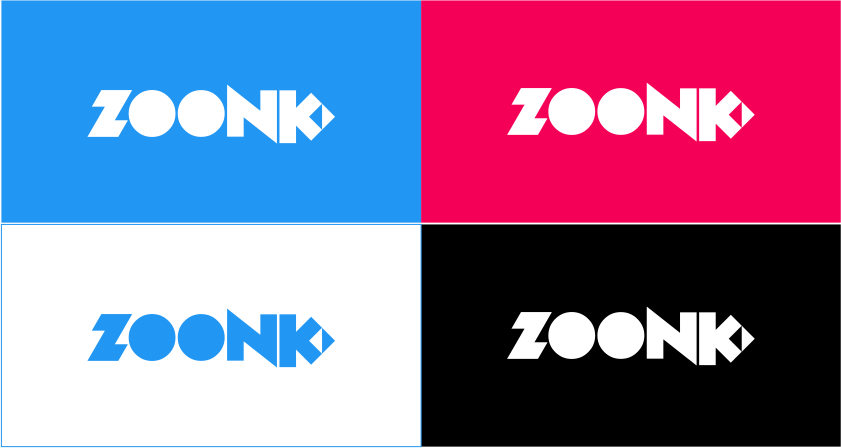
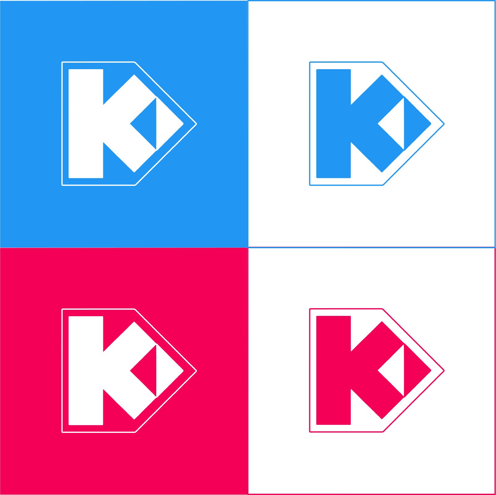

# Zoonk's visual identity

You can find here all visual identity resources available for Zoonk. Please,
feel free to [open an issue](https://github.com/zoonk/design/issues/new) to
discuss improvements or for making suggestions.

## Logo

## Icon

## Colors

- **Primary**:  `#2196F3`
- **Primary (light)**:  `#64b5f6`
- **Primary (dark)**:  `#1976d2`
- **Secondary**:  `#F50057`
- **Secondary (light)**:  `#ff4081`
- **Secondary (dark)**:  `#c51162`

## Credits

- **Logo**: [Everton Teixeira](https://www.facebook.com/BolaCultural)
